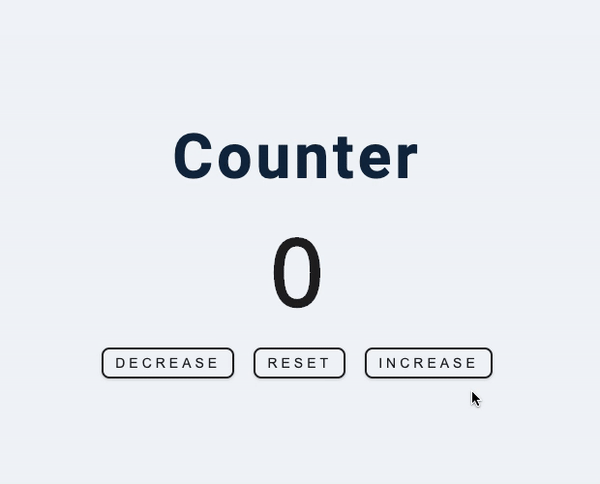
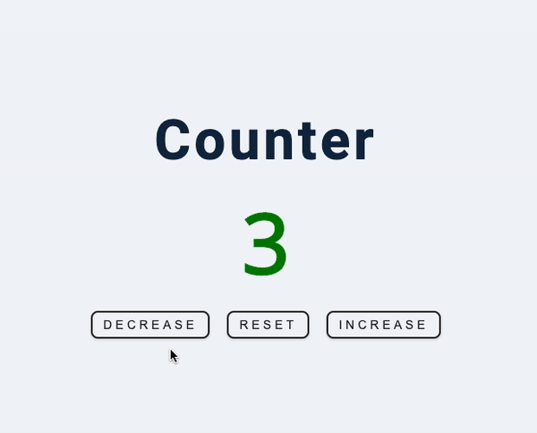
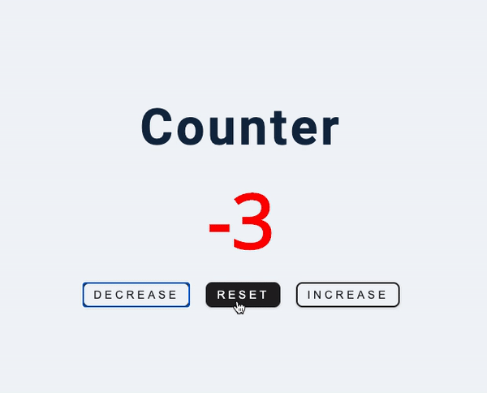

# Pictionary Counter

This application will allow the user to increment, decrement, or reset a number on the screen.

You can style the project according to your team's taste and what you envision for the selected persona.

This application has three buttons that manipulate the number displayed on the screen. One that decrements, one that increments and one that resets.

[See Demo](https://drteresavasquez.github.io/pictionary-counter/setup/)

- Incrementing

  

- Decrementing

  

- Resetting

  

## Installing Project 2

To install Project 2, follow these steps:

```

git clone <ADD_URL_HERE>

```

## Using Project 2

To use Project 2, follow these steps:

```shell

hs -o setup/index.html

```

## Acceptance Criteria

1. Scenario 1: As a user, I want to see the value of the Pictionary counter.

   - **Given** the user wants to know the value of the Pictionary counter
   - **When** the user opens the application
   - **Then** display the value of the Pictionary counter on the screen.

1. Scenario 2: As a user, I want to add to the value of the Pictionary counter.

   - **Given** the user wants to add to the value of the Pictionary counter
   - **When** the user clicks on a button below the Pictionary counter (labeled so)
   - **Then** The Pictionary counter should increase by 1

1. Scenario 3: As a user, I want to take away from the value of the Pictionary counter

   - **Given** the user wants to decrement the value of the Pictionary counter
   - **When** the user clicks on a button below the Pictionary counter (labeled so)
   - **Then** The Pictionary counter should decrease by 1

1. Scenario 4: As a user, I want to reset the value of the Pictionary counter.

   - **Given** the user wants to reset the value of the Pictionary counter
   - **When** the user clicks on a button below the Pictionary counter (labeled so)
   - **Then** The Pictionary counter should reset to 0

1. Scenario 5: As a user, I want to easily see that the value of the Pictionary counter is a negative number

   - **Given** the user wants to visually see that the value of the Pictionary counter is negative
   - **When** the Pictionary counter shows a negative number
   - **Then** turn the color of the number a shade of red

1. Scenario 6: As a user, I want to easily see that the value of the Pictionary counter is a positive number

   - **Given** the user wants to visually see that the value of the Pictionary counter is positive
   - **When** the Pictionary counter shows a positive number
   - **Then** turn the color of the number a shade of green

1. Scenario 6: As a user, I want to easily see that the value of the Pictionary counter is a neutral number (or 0)

   - **Given** the user wants to visually see that the value of the counter is neutral
   - **When** the Pictionary counter shows a neutral number
   - **Then** turn the color of the number a black

1. Scenario 7: As a user, I want the Pictionary counter in the center of the screen no matter what device I am on.

   - **Given** the user opens the application
   - **When** the user is looking at the Pictionary counter
   - **Then** center the Pictionary counter and buttons on page
   
## Stretch Goal 1
- Have 2 Pictionary counters on the screen so that one user can keep track of two team's scores

## Stretch Goal 2
- Add a button that allows users to add as many Pictionary counters as they would like for the amount of teams that may want to play
- Allow the user to name the Pictionary counter
- Remove the ability to allow negative numbers for scores

## Strech Goal 3
- Allow users to delete counters
- Allow users to edit their team names
